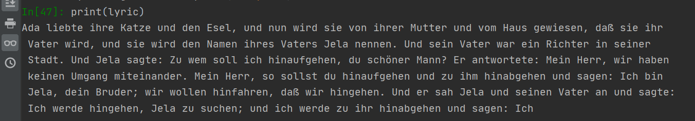

# Juli Zeh Lyrics Generator
## Natural Language Generation Neural Net
### pretrained GPT-2 for text generation in German
------------


*Warning*: The following GPT-2 model was pretrained on an unknown German corpus by an [anonymous user at huggingface](https://huggingface.co/anonymous-german-nlp/german-gpt2). Therefore, we cannot rule out embedding biases and enabling unintended negative uses induced by the corpus. In addition, the German novel used for fine-tuning contains explicit language. When using the model, please be aware that all content used for pretraining and fine-tuning will affect the generated text.

For an example for biased text generation see [here](https://huggingface.co/gpt2#limitations-and-bias).

## Installation:
For installation see: [huggingface](https://huggingface.co/transformers/installation.html)
Transformers can either be based on  Tensorflow, Pytorch or both. 
The present model is based on Tensorflow.

## Content: 

1. Installation inside venv: 1. TF and/or 2. Pytorch and 3. transformers
1. install dependencies
1. load the dataset
1. prepare the dataset and build a TextDataset
1. load the pre-trained German-GPT-2 model and tokenizer
1.initialize Trainer with Training Arguments
1. train and save the model
1. test the model

## Dependencies

## Data 
Model pre-trained on German text and fine-tuned on novel "Spieltrieb" by Juli Zeh.  Data contains only parts of the novel with randomized chapters to prevent copyright violations. 

Txt-file consists of 79886 words. Txt file can be found in 'data' folder.

## Preprocessing
For text preprocessing it is important to use the same tokenizer as was used for pretraining the model. In this case we use the "german-gpt2" tokenizer as provided by an [anonymous user at huggingface](https://huggingface.co/anonymous-german-nlp/german-gpt2).

```python
tokenizer = AutoTokenizer.from_pretrained("anonymous-german-nlp/german-gpt2")
```
## Model
Caution: We use a GPT-2 pretrained on an unknown German corpus. Therefore, we cannot rule out embedding biases and enabling unintended negative uses.

For the English version, [huggingface](https://huggingface.co/transformers/v3.3.1/task_summary.html) states that GPT2 "was trained on millions of webpages with a causal language modeling objective" However, it is unclear which sources were used to pretrain the German model and how large the corpus was. 
 
```python
model = AutoModelWithLMHead.from_pretrained("anonymous-german-nlp/german-gpt2")
```

## Result
Model is trained and saved and able to generate lyrics. 
Unfortunately the pretrained model cannot be saved in github because of its size (~500MB).

Neural nets calculate probabilities. In its basic version - greedy search - the neural net simply selects the word with the highest probability as its next word. As a result, AI-generated texts often suffer from repetitions.

There are different possibilities to add some randomness to text generation, such as using temperature or penalizing n-gram repetitions (for different temperature options, see also my LSTM RNN). 

In GPT-2 top-k sampling was introduced. 

```python
outputs = german_model.generate(inputs, max_length = max_length, do_sample=True, top_p=0.95, top_k=50,num_return_sequences=3)

```


top_k => In Top-K sampling, the K most likely next words are filtered and the probability mass is redistributed among only those K next words.

top_p => Having set p=0.95, Top-p sampling picks the minimum number of words to exceed together p=.95% of the probability mass


## Outlook 
According to [huggingface](https://huggingface.co/transformers/v3.3.1/task_summary.html), "Text generation is currently possible with GPT-2, OpenAi-GPT, CTRL, XLNet, Transfo-XL and Reformer in PyTorch and for most models in Tensorflow as well. [...] GPT-2 is usually a good choice for open-ended text generation because it was trained on millions of webpages with a causal language modeling objective." 
It would be really interesting to compare the quality of generated text by German pretrained text generation models. 

## Resources
# for text generation sampling see https://huggingface.co/blog/how-to-generate